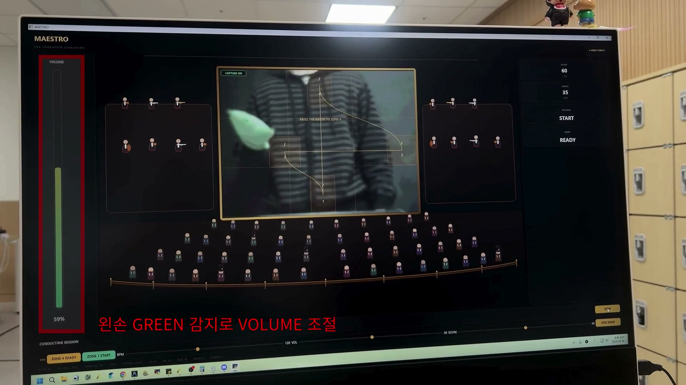
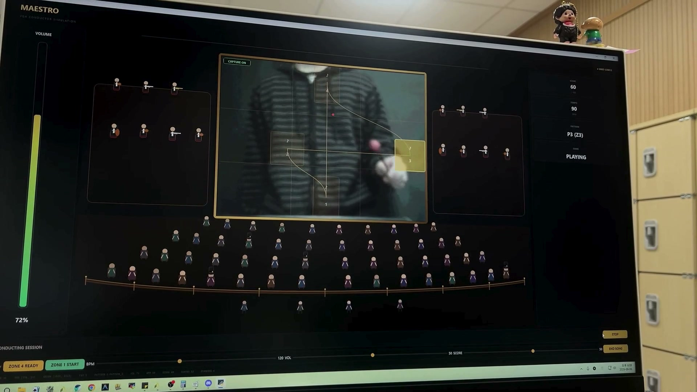
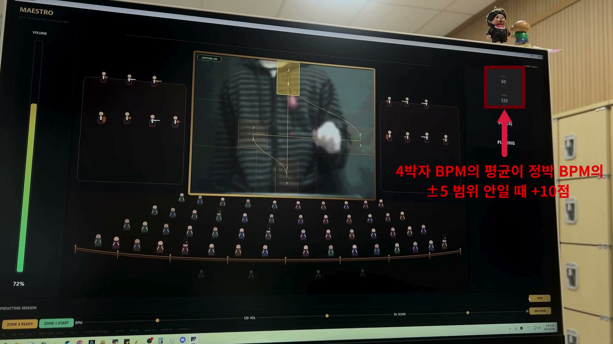
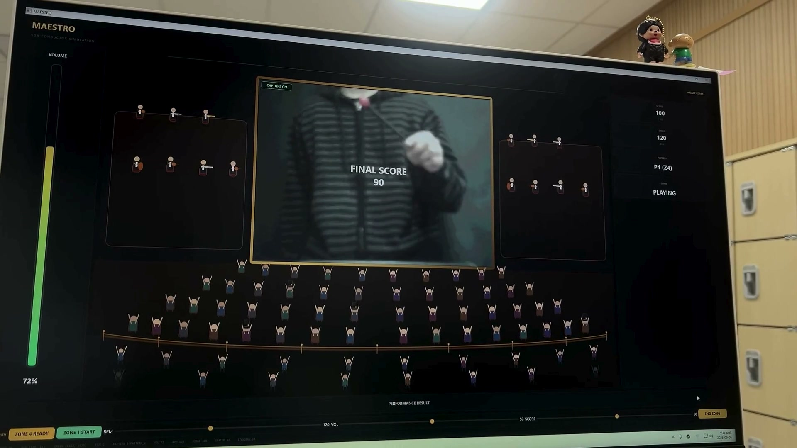

# Maestro: FPGA VGA 지휘 시뮬레이션 게임

OV7670 카메라로 지휘봉과 손의 움직임을 인식하고, 지휘 동작에 맞춰 음악의 박자·속도·음량을 실시간으로 제어하는 FPGA 기반 인터랙티브 게임입니다. 영상 전처리와 게임 판정은 FPGA에서 수행하고, PC 애플리케이션은 무대 UI, MIDI 재생, 음향 효과 및 결과 화면을 담당합니다.

> 7명이 함께 카메라/VGA, 색상 및 좌표 검출, 지휘 패턴, 속도·음량·점수 계산, UART, PC UI와 검증 환경을 분담하여 개발했습니다.

[시연 영상](<docs/demo/지휘게임 시연영상.mp4>) · [프로젝트 발표 자료](docs/ppt/3팀_지휘시뮬레이션게임.pdf)

## 구현 화면

아래 이미지는 저장소의 시연 영상에서 추출한 실제 FPGA-PC 연동 화면입니다.

### 손 위치 기반 음량 제어

초록색 표식의 Y 좌표를 실시간 음량으로 변환합니다.



### 4박 지휘 패턴 인식

현재 Zone, BPM, 점수와 게임 상태를 실시간으로 표시합니다.



### BPM 기반 점수 계산

4박 평균 속도를 곡의 기준 BPM과 비교하여 점수를 계산합니다.



### 최종 결과 화면

최종 점수에 따라 관객 반응과 결과 음향을 변경합니다.



## 주요 기능

- **실시간 영상 입력**: OV7670의 RGB565 영상을 320×240 프레임 버퍼에 저장하고 VGA로 출력
- **색상 기반 객체 인식**: RGB444 영상에서 빨간색 지휘봉과 초록색 손 표식을 검출
- **지휘 패턴 판정**: 지휘봉의 좌표가 4개 영역을 순서대로 통과하는지 FSM으로 판정
- **템포 제어**: 지휘 동작의 주기를 BPM으로 환산하여 MIDI 재생 속도에 반영
- **음량 제어**: 손의 Y 좌표를 0~100 단계의 음량으로 변환
- **게임 점수 계산**: 선택한 곡의 기준 BPM과 사용자의 평균 지휘 속도를 비교해 점수를 증감
- **PC 연동**: UART로 게임 상태와 센서 데이터를 교환하고 PySide6 UI에 실시간 반영
- **게임 연출**: 곡 선택, 관객 애니메이션, 박수·야유, 결과별 음향 효과 제공
- **검증 환경**: 주요 RTL 모듈의 단위 테스트벤치와 game logic/RGB detect/UART용 UVM 테스트벤치 제공

## 시스템 구성

### 전체 데이터 흐름

**영상 처리 경로**

`OV7670 카메라` → `카메라 설정` → `프레임 버퍼` → `VGA 출력` → `VGA/HDMI 캡처` → `PC 화면`

**게임 제어 경로**

`프레임 버퍼` → `RGB 색상 필터` → `지휘봉/손 좌표 검출` → `게임 로직` → `UART` → `PC 애플리케이션`

| 입력 | FPGA 내부 처리 | PC 출력 |
| --- | --- | --- |
| 빨간색 지휘봉 좌표 | 4박 지휘 패턴 판정, BPM 계산 | 패턴 및 템포 표시, MIDI 한 박 재생 |
| 초록색 손 표식 좌표 | 손의 높이를 0~100 음량으로 변환 | 볼륨 바 표시, MIDI 음량 변경 |
| 측정 BPM + 곡 기준 BPM | 4박 평균 비교 및 점수 계산 | 점수, 관객 반응, 결과 음향 표시 |
| PC 게임 상태 + 곡 번호 | 게임 FSM 및 기준 BPM 설정 | Ready/Playing/Result 화면 전환 |

FPGA와 PC는 **115200 bps UART**로 연결됩니다. FPGA는 좌표·패턴·BPM·음량·점수를 64비트 패킷으로 보내고, PC는 게임 상태와 선택한 곡 번호를 1바이트로 전송합니다.

## 구현 방법

### 1. 카메라 입력과 VGA 출력

`SCCB_Setup_controller`가 ROM에 저장된 레지스터 설정값을 I²C/SCCB로 전송해 OV7670을 초기화합니다. 카메라가 8비트씩 보내는 데이터를 `ov7670_mem_controller`에서 두 번 수신해 16비트 RGB565 픽셀로 조립합니다.

조립된 320×240 프레임은 서로 다른 클록을 사용하는 프레임 버퍼에 저장됩니다. 카메라 `pclk` 도메인에서 쓰고 시스템 클록 도메인에서 읽으며, `vga_decoder`와 `rom_reader_upscale`이 640×480 VGA 타이밍과 RGB444 출력 신호를 생성합니다.

```text
OV7670 8-bit data × 2
        ↓
RGB565 16-bit pixel
        ↓
320×240 Frame Buffer
        ↓
640×480 VGA timing + RGB444
```

### 2. 색상 필터와 좌표 검출

`rgb_filter`는 RGB444의 각 채널을 분리한 뒤, 특정 채널의 최솟값과 다른 채널과의 차이를 함께 비교합니다. 단순히 R 또는 G 값만 확인하지 않고 색상 간 margin을 적용해 조명과 배경에 의한 오검출을 줄였습니다.

`xy_detection`은 한 프레임을 스캔하면서 왼쪽·위·왼쪽 위 픽셀을 확인하는 라인 버퍼를 사용합니다. 주변에 같은 색이 이어진 픽셀만 군집 후보로 인정하고, 최소 픽셀 수를 만족한 군집의 Bounding Box 중심을 최종 좌표로 사용합니다.

- 빨간색 군집 중심 → 지휘봉 `(RED_X, RED_Y)`
- 초록색 군집 중심 → 손 표식 `(GREEN_X, GREEN_Y)`
- 검출 실패 → 좌표 `1023`을 전송해 정상 좌표와 구분
- 프레임 종료 시 좌표를 확정하고 UART에 `valid` 신호 전달

### 3. 지휘 패턴 FSM

`pattern_stick`은 화면을 네 개의 지휘 영역으로 나누고 빨간색 지휘봉이 영역을 순서대로 통과하는지 검사합니다.

| Zone   |  X 범위 |  Y 범위 | 의미                       |
| ------ | ------: | ------: | -------------------------- |
| Zone 1 | 140~180 | 175~240 | 화면 아래 중앙, 첫 박      |
| Zone 2 |  75~125 | 110~160 | 화면 왼쪽, 둘째 박         |
| Zone 3 | 270~320 | 110~160 | 화면 오른쪽, 셋째 박       |
| Zone 4 | 140~180 |    0~60 | 화면 위 중앙, 넷째 박/준비 |

상태는 `START → READY → P1 → P2 → P3 → P4 → P1 ...` 순서로만 전이합니다. 예상과 다른 Zone이 먼저 들어오면 다음 박으로 인정하지 않아 잘못된 움직임이나 좌표 노이즈가 음악 진행으로 이어지는 것을 막습니다.

### 4. BPM, 음량과 점수 계산

| 기능 | 구현 방식                                                                                                                                                           |
| ---- | ------------------------------------------------------------------------------------------------------------------------------------------------------------------- |
| BPM  | `stick_speed_calc`가 패턴 tick 사이의 시간을 1 ms 단위로 측정하고 `60000 / 경과 시간(ms)`으로 환산합니다. 결과는 30~220 BPM 범위에서 5 BPM 단위로 양자화합니다.     |
| 음량 | `volume_ctrl`이 30프레임 동안 손을 확인해 기준 Y 좌표를 잡은 뒤 10프레임마다 `현재 음량 + (기준 Y - 현재 Y) / 2`를 계산하고 0~100으로 제한합니다.                   |
| 점수 | `game_score`가 네 번의 지휘 속도 평균과 곡의 기준 BPM 차이를 비교합니다. 차이가 5 BPM 미만이면 +10점, 30 BPM을 초과하면 -10점으로 처리하며 0~100 범위를 유지합니다. |

FPGA 내부 점수는 0~10으로 저장하고 PC UI에서 10을 곱해 0~100점으로 표시합니다.

### 5. UART 데이터 통합

각 기능 모듈은 `valid/ready` 핸드셰이크로 최신 값을 `uart_data_control`에 전달합니다. 이 모듈이 게임 상태, 좌표, 패턴, 음량, BPM과 점수를 하나의 64비트 패킷으로 조립하고 `uart_wrapper`가 8바이트 little-endian 데이터로 PC에 전송합니다.

반대 방향에서는 PC가 게임 상태와 선택한 곡을 1바이트로 보내며, `game_fsm`과 `song_decoder`가 이를 받아 FPGA의 게임 시작·종료 및 기준 BPM을 설정합니다.

### 6. PC UI와 MIDI 재생

PC 애플리케이션은 FPGA가 계산한 결과를 다시 판정하지 않고 화면 연출과 음악 재생에 사용합니다.

- `SerialComm`: 115200 bps UART 송수신과 64비트 패킷 복원
- `GameController`: Title → Menu → Ready → Playing → Result 상태 관리
- `CaptureManager`: VGA/HDMI 캡처 영상을 중앙 무대에 표시하고 장치 재연결 처리
- `MidiPlayer`: 올바른 Zone 전이가 발생할 때마다 MIDI를 정확히 한 박씩 진행하고 FPGA BPM/음량 적용
- `MainWindow`: 검출 좌표, 현재 Zone, BPM, 점수, 관객 입장·퇴장 및 결과 화면 표시

이 구조를 통해 영상과 게임 판정처럼 지연에 민감한 처리는 FPGA가 맡고, 고수준 UI와 오디오는 PC가 맡도록 역할을 분리했습니다.

### 게임 진행 흐름

1. PC UI에서 곡을 선택하면 게임 상태와 곡 번호를 FPGA로 전송합니다.
2. 지휘봉을 Zone 4에 위치시켜 준비한 뒤 Zone 1으로 이동하면 연주가 시작됩니다.
3. `Zone 1 → Zone 2 → Zone 3 → Zone 4` 순서가 완성될 때마다 다음 박의 MIDI 이벤트가 재생됩니다.
4. FPGA가 측정한 지휘 속도와 손 높이가 각각 음악의 BPM과 음량에 반영됩니다.
5. 기준 BPM과 지휘 속도의 차이에 따라 점수가 바뀌고, 관객 및 효과음이 점수에 맞춰 반응합니다.
6. 곡이 끝나면 최종 점수와 결과 음향을 출력한 후 메인 화면으로 돌아갑니다.

## 사용 기술

| 구분            | 기술                                            |
| --------------- | ----------------------------------------------- |
| FPGA/RTL        | SystemVerilog, AMD Vivado, UVM 1.2              |
| 보드/센서       | Digilent Basys 3, OV7670 카메라                 |
| 영상 출력       | VGA, RGB444, 640×480 출력 / 320×240 유효 영상   |
| 통신            | UART 115200 bps, 8-N-1                          |
| PC 애플리케이션 | Python, PySide6, OpenCV, PySerial               |
| 오디오          | Mido, pygame-ce, MIDI                           |
| 검증            | SystemVerilog testbench, UVM, VCS 기반 UVM 설정 |

## 저장소 구조

```text
fpga-vga-conductor-game/
├── rtl/
│   ├── cam/             # OV7670 설정, 프레임 버퍼, VGA 타이밍
│   ├── filter_detect/   # RGB 필터와 객체 좌표 검출
│   ├── game/            # 패턴, BPM, 음량, 점수, 게임 FSM
│   ├── top/             # 최상위 통합 모듈
│   └── uart/            # UART 송수신, FIFO, 패킷 제어
├── tb/
│   ├── unit/            # 모듈 단위 테스트벤치
│   └── uvm/             # game logic, RGB detect, UART UVM 환경
├── UI/
│   ├── assets/          # MIDI와 효과음 리소스
│   ├── main.py          # PC 애플리케이션 진입점 및 게임 제어
│   ├── protocol.py      # FPGA-PC 패킷 인코딩/디코딩
│   ├── serial_comm.py   # UART 통신
│   └── ui.py            # PySide6 화면 및 무대 연출
├── XDC/                 # Basys 3 핀 제약 파일
└── docs/                # 발표 자료와 시연 영상
```

## 실행 방법

### 1. 하드웨어 준비

- Digilent Basys 3 보드
- OV7670 카메라 모듈
- VGA 모니터 또는 VGA/HDMI 캡처 장치
- FPGA-PC UART 연결
- MIDI 출력이 가능한 Windows PC

핀 연결은 [`XDC/Basys-3-Master.xdc`](XDC/Basys-3-Master.xdc)를 기준으로 합니다. 카메라의 전원 및 I/O 전압이 보드 규격과 맞는지 반드시 확인한 뒤 연결하세요.

### 2. FPGA 빌드

이 저장소에는 생성된 Vivado 프로젝트 파일을 포함하지 않습니다. Vivado에서 RTL 프로젝트를 새로 만든 뒤 다음과 같이 구성합니다.

1. 타깃 보드를 **Basys 3 (`xc7a35tcpg236-1`)**로 설정합니다.
2. `rtl/` 아래의 모든 `.sv` 파일을 Design Sources에 추가합니다.
3. `rtl/cam/ov7670_setup_rom.mem`을 Memory Initialization File로 추가합니다.
4. `XDC/Basys-3-Master.xdc`를 Constraints에 추가합니다.
5. 최상위 모듈을 `TOP_MG_VGA`로 지정합니다.
6. Synthesis → Implementation → Bitstream 생성을 진행한 뒤 Basys 3에 프로그램합니다.

보드 스위치는 다음 영상 확인 용도로 사용할 수 있습니다.

| 입력        | 기능                              |
| ----------- | --------------------------------- |
| `sw_mode`   | 원본 QVGA/업스케일 출력 경로 선택 |
| `sw_invert` | 유효 영상 바깥 영역의 흑백 반전   |
| `SW_RED`    | 빨간색 검출 결과 표시             |
| `SW_GREEN`  | 초록색 검출 결과 표시             |
| `SW_BLUE`   | 파란색 검출 결과 표시             |

### 3. PC 애플리케이션 설치

Python 3.11 이상을 권장합니다. 저장소 루트에서 다음 명령을 실행합니다.

```powershell
python -m venv .venv
.\.venv\Scripts\Activate.ps1
python -m pip install --upgrade pip
python -m pip install -r UI\requirements.txt
```

### 4. 포트 및 캡처 장치 설정

[`UI/main.py`](UI/main.py) 상단의 설정값을 PC 환경에 맞게 수정합니다.

```python
UART_MODE = "REAL"       # 하드웨어 없이 UI만 확인하려면 "MOCK"
UART_PORT = "COM13"      # 장치 관리자에서 확인한 포트
UART_BAUDRATE = 115200

CAPTURE_DEVICE_INDEX = 2 # VGA/HDMI 캡처 장치 인덱스
```

`REAL` 모드에서 UART 연결에 실패하면 애플리케이션은 자동으로 Mock 모드로 전환됩니다. 캡처 장치를 찾지 못해도 UART 좌표 추적과 게임 로직은 계속 동작합니다.

### 5. UI 실행

저장소 루트에서 패키지 모듈 형태로 실행합니다.

```powershell
python -m UI.main
```

Windows에서 MIDI 소리가 나지 않는다면 시스템의 MIDI 출력 장치와 오디오 출력 설정을 먼저 확인하세요.

## UART 프로토콜

통신 설정은 **115200 bps, 8 data bits, no parity, 1 stop bit**입니다.

### PC → FPGA: 1 byte

| Bit     | 필드         | 설명                               |
| ------- | ------------ | ---------------------------------- |
| `[7:4]` | `GAME_STATE` | Main, Menu, Ready, Game, Stop 상태 |
| `[3:0]` | `SONG_NUM`   | 선택한 곡 번호(0~4)                |

### FPGA → PC: 8 bytes, little-endian

| Bit       | 필드       | 설명                          |
| --------- | ---------- | ----------------------------- |
| `[63:62]` | `GAME_FSM` | FPGA 게임 상태                |
| `[61:52]` | `RED_X`    | 빨간색 지휘봉 X 좌표          |
| `[51:42]` | `RED_Y`    | 빨간색 지휘봉 Y 좌표          |
| `[41:32]` | `GREEN_X`  | 초록색 손 표식 X 좌표         |
| `[31:22]` | `GREEN_Y`  | 초록색 손 표식 Y 좌표         |
| `[21:19]` | `PATTERN`  | 지휘 패턴 상태                |
| `[18:12]` | `VOLUME`   | 음량(0~100)                   |
| `[11:4]`  | `SPEED`    | 지휘 속도(BPM)                |
| `[3:0]`   | `SCORE`    | 게임 점수(0~10, UI에서는 ×10) |

수록 곡은 학교종, 나비야, Mozart - Eine Kleine, Ode to Joy, Vivaldi - Spring의 5곡입니다.

## 검증

- `tb/unit/`: RGB 필터, 좌표 검출, 지휘 패턴, 속도, 음량, 점수, FSM, UART 등 모듈별 테스트벤치
- `tb/uvm/uvm_game_logic/`: 전체 게임 시나리오와 상태 전이 검증
- `tb/uvm/uvm_rg_detect/`: 색상/좌표 검출 에이전트, 스코어보드 및 커버리지
- `tb/uvm/uvm_uart_wrapper/`: UART 패킷 송수신, 모니터, 스코어보드 및 커버리지

단위 테스트는 Vivado Simulator 등 SystemVerilog 지원 시뮬레이터에서 실행할 수 있습니다. UVM 테스트는 UVM 1.2를 지원하는 시뮬레이터가 필요하며, `uvm_game_logic`의 Makefile은 VCS/Verdi 환경을 기준으로 작성되어 있습니다.

## 팀 구성 및 담당 영역

아래 내용은 Git 커밋 이력을 기준으로 정리한 주요 기여 영역입니다. `hans`와 `realisshoon`은 동일 이메일의 계정 별칭으로 하나의 팀원으로 집계했습니다.

| 팀원                                                      | 주요 기여 영역                                                                         |
| --------------------------------------------------------- | -------------------------------------------------------------------------------------- |
| 이영현 [@younghyun0702](https://github.com/younghyun0702) | 게임 FSM, 지휘 속도 계산, UART 데이터 제어, 게임 로직 및 Top 통합                      |
| 이민 [@Min-star-prog](https://github.com/Min-star-prog)   | 지휘 패턴 FSM, 점수 로직, 관련 단위 테스트 및 game logic UVM                           |
| 이승열 [@lsy49055089](https://github.com/lsy49055089)     | 객체 좌표 검출, 곡/BPM 디코더, PC UI 및 오디오·MIDI 연동                               |
| 지승배 [@ron2011](https://github.com/ron2011)             | UART 송수신·FIFO·핸드셰이크, UART wrapper UVM                                          |
| 조정민 [@jjm15955](https://github.com/jjm15955)           | 손 위치 기반 음량 제어 모듈 및 단위 테스트                                             |
| 유지민 [@jimin-max](https://github.com/jimin-max)         | 지휘 속도 계산 모듈 초기 구현 및 단위 테스트                                           |
| 한승훈 [@realisshoon](https://github.com/realisshoon)     | 저장소 및 브랜치 통합, RGB 필터, 좌표 검출 통합, Top 모듈, RTL-PC 통합, RGB detect UVM |

## 브랜치 전략

- `main`: 정상 동작이 확인된 최종 안정 버전
- `integration`: 기능 통합 및 FPGA 검증 브랜치
- `feat/*`: 기능별 개발 브랜치

개발 기능은 `feat/* → integration → main` 순서로 통합하고, Pull Request에서 시뮬레이션·인터페이스·FPGA 동작 여부를 확인했습니다.
